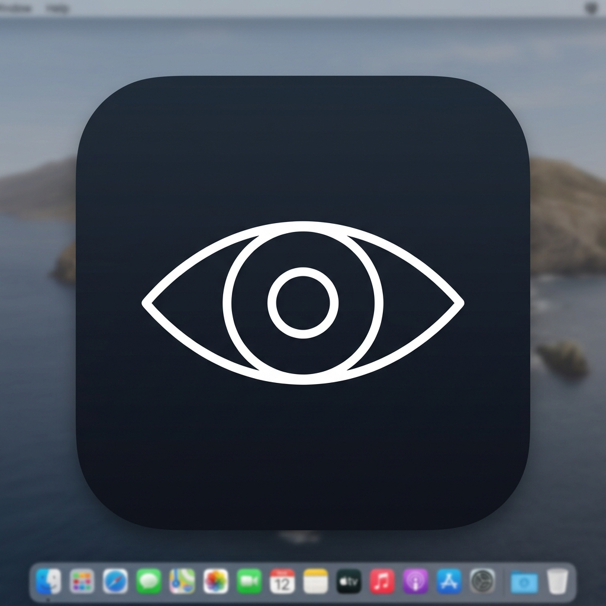
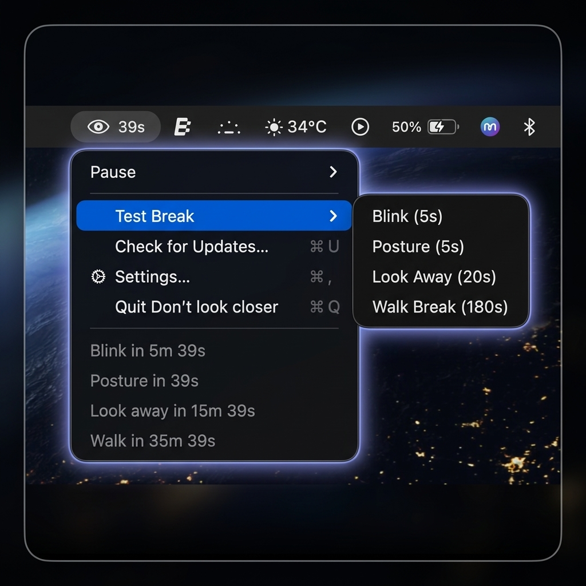
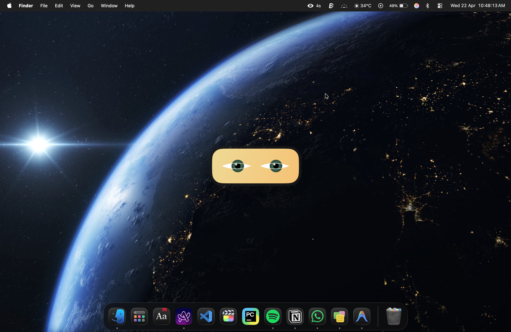
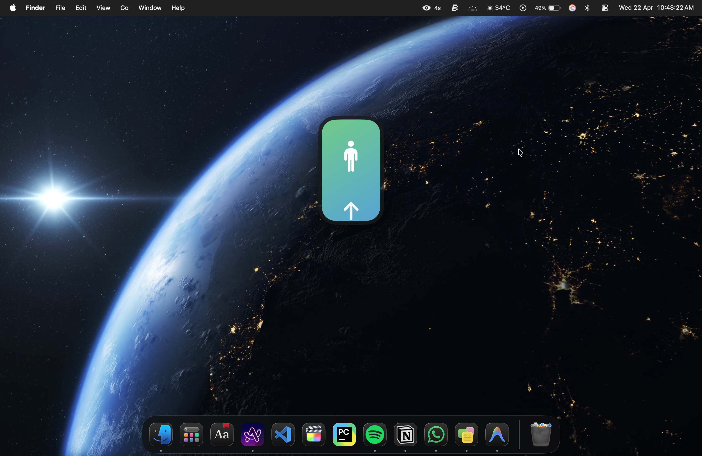
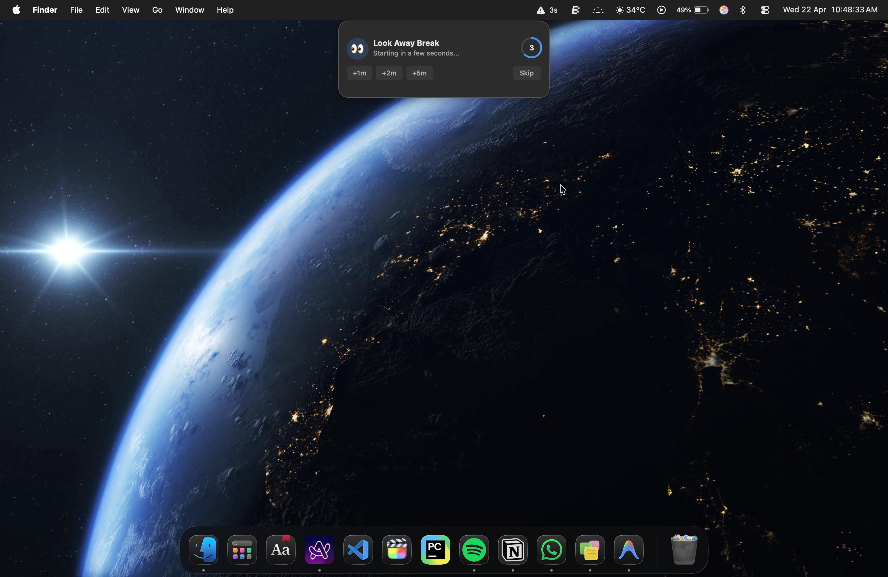
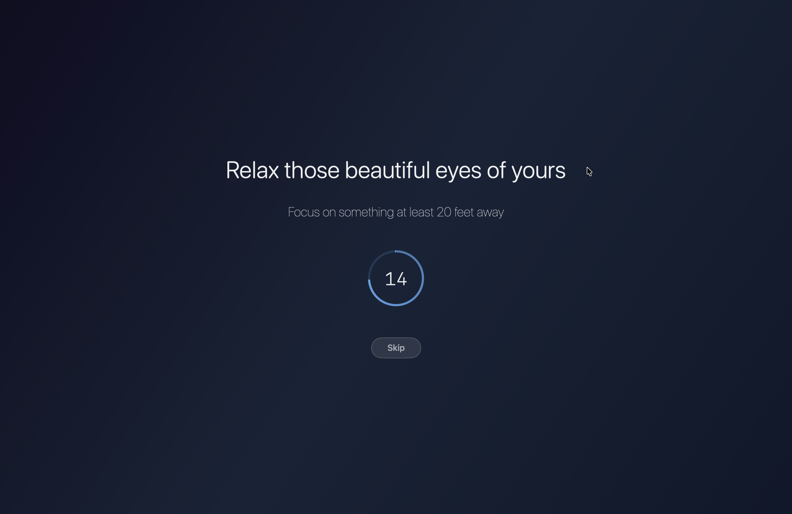
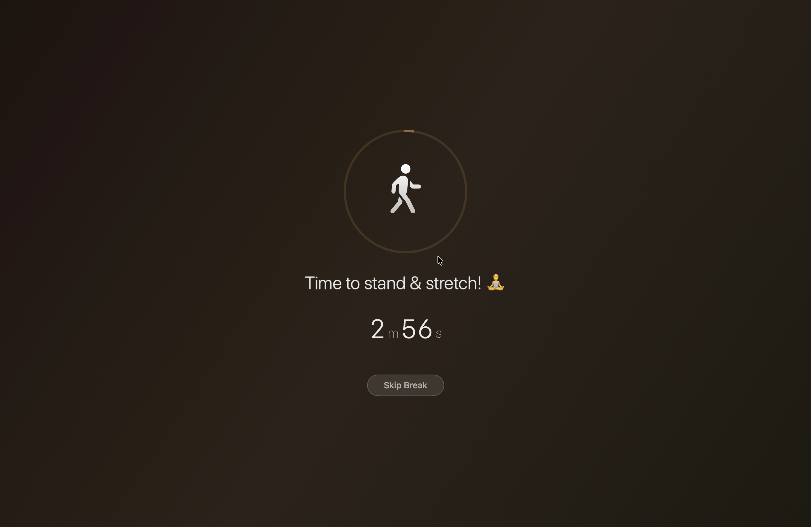

# Don't look closer

**A gentle, intelligent break reminder for macOS — lives quietly in your menu bar.**

[**⬇️ Download for Mac**](https://github.com/VivekKumarKamal/Do-Not-Look-Closer/releases/download/v3.0.0/Don't%20look%20closer.dmg)

---

## What is it?

**Don't look closer** is a lightweight macOS menu bar app that helps you take care of your eyes and body while working at a computer. It quietly runs in the background and reminds you to:

- **👀 Blink** — Quick 5-second reminders to blink and refresh your eyes
- **🧘 Sit up straight** — Posture checks every 30 minutes
- **🔭 Look away (20/20/20 rule)** — Look 20 feet away for 20 seconds every 20 minutes
- **🚶 Walk** — Get up and move periodically throughout your day

Every reminder type is fully **configurable** and **individually toggleable** — use only the ones you want.

---

## Screenshots

| Menu Bar | Blink Break | Posture Break |
|:---:|:---:|:---:|
|  |  |  |
| *Live countdown timers* | *Animated eye reminder* | *Sit up straight* |

| Look Away Warning | Look Away Break | Walk Break |
|:---:|:---:|:---:|
|  |  |  |
| *Pre-break countdown* | *20/20/20 rule* | *Time to stand & stretch* |

---

## Features

### 🔔 Four Break Types
| Break | Duration | Default Interval | What it does |
|-------|----------|-----------------|--------------|
| 👀 Blink | 5s | Every 10 min | Animated eye reminder to blink slowly |
| 🧘 Posture | 5s | Every 30 min | Reminder to sit up and check your posture |
| 🔭 Look Away | 20s | Every 20 min | 20/20/20 rule — rest your eyes on a distant object |
| 🚶 Walk | Configurable | Every 60 min | Get up, move, stretch! |

### ⏸️ Smart Pause Controls
- **Timed Pause** — Pause for 30 minutes, 1 hour, or 5 hours with automatic resume
- **Pause ∞** — Pause indefinitely until you're ready
- **Live countdown** — The menu bar shows time remaining while paused

### 🌙 Auto-Pause (Focus Mode)
Breaks are automatically paused when you're:
- **In a meeting or call** — detects active microphone/camera usage
- **Screen recording** — detects OBS, ScreenFlow, and similar apps

Breaks resume automatically when the activity ends.

### ⚙️ Highly Configurable
- Enable/disable **each reminder type individually**
- Adjust **intervals** with sliders (per break type)
- **Strict Mode** — disables the skip button so you actually take the break
- **Sound effects** — optional audio cues
- **Launch at login** — always running in the background

## Download

### [⬇️ Download Don't look closer v3.0.0 (.dmg)](https://github.com/VivekKumarKamal/Do-Not-Look-Closer/releases/download/v3.0.0/Don't%20look%20closer.dmg)

**Installation:**
1. Download the `.dmg` file
2. Open it and drag **Don't look closer** to your Applications folder
3. Launch the app — it will appear in your menu bar as an eye icon 👁

> **Note:** On first launch, macOS may show a security prompt. Go to **System Settings → Privacy & Security** and click "Open Anyway" to allow it.

---

## Privacy

**Don't look closer** requires no special permissions and collects no data.

The Auto-Pause feature optionally checks microphone/camera activity and running app names — all locally, never leaving your device.

---

Built with ❤️ by [Vivek Kumar](https://www.linkedin.com/in/vivekkumarkamal) · © 2026

